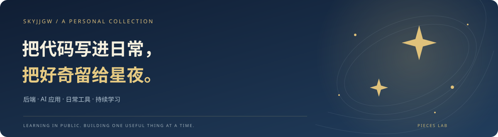

<b>你好，我是 SKYJJGW。</b> 软件工程本科在读，把学习写进项目，把想法做成可以使用的工具。

  <a href="https://skyjjgw.com"><b>走进个人网站 ↗</b></a> ·
  <a href="#星夜作品馆">星夜作品馆</a> ·
  <a href="#项目陈列室">项目陈列室</a> ·
  <a href="#学习手记">学习手记</a> ·
  <a href="#联系我">联系我</a>

  
  
  
  

## 关于我

我对 **AI 怎样进入真实的软件流程** 很感兴趣：从文档检索与问答，到自动化流程，再到用户能直接操作的桌面应用。

目前主要用 **Python / FastAPI** 实践后端和 AI 应用，也在学习 **Java / Spring Boot**。这里既有相对完整的工具，也有进行中的实验；具体能力与运行方式以各项目仓库说明为准。

## 星夜作品馆

把个人网站当成一座可以走进去的小展馆：在《星月夜》的背景下，用四幅立体画框展示自我介绍、项目与代码、学习手记和关于页面。作品卡片与手记可以在画框内操作，也可以切换浏览节奏或进入全屏。

**[在线访问 ↗](https://skyjjgw.com)** · [项目介绍](projects/starry-museum.md) · [个人站静态快照](https://github.com/skyjjgw/skyjjgw-starry-museum) · [匿名模板源码](https://github.com/skyjjgw/starry-museum-portfolio)

个人站版本保留真实个人资料；匿名模板使用示例资料，两者分开维护。

## 项目陈列室

<table width="100%">
<thead><tr><th width="260" align="left">项目</th><th width="760" align="left">在做什么</th><th width="180" align="left">方向</th></tr></thead>
<tbody>
<tr><td><a href="https://github.com/skyjjgw/An-edge-cloud-collaborative-assistive-navigation-system-for-visually-impaired-users"><b>视障辅助导航</b></a></td><td>探索云端服务、边缘视觉感知与志愿者端协同的辅助系统。</td><td>多端协同</td></tr>
<tr><td><a href="https://github.com/skyjjgw/enterprise-rag-knowledge-base"><b>Enterprise RAG</b></a></td><td>围绕文档解析、混合检索和多步问答构建知识库应用。</td><td>AI / RAG</td></tr>
<tr><td><a href="https://github.com/skyjjgw/BookTranslator"><b>BookTranslator</b></a></td><td>尝试把文档提取、模型翻译、术语复用和断点恢复连成流程。</td><td>文档工具</td></tr>
<tr><td><a href="https://github.com/skyjjgw/drip-browser-source"><b>Drip Browser</b></a></td><td>基于 Electron 的 Windows 浏览器源码快照，探索标签页和桌面交互。</td><td>桌面应用</td></tr>
<tr><td><a href="https://github.com/skyjjgw/xmind-to-html"><b>XMind → HTML</b></a></td><td>将思维导图转换为可独立打开的交互式 HTML。</td><td>效率工具</td></tr>
<tr><td><a href="https://github.com/skyjjgw/QuickNotes"><b>QuickNotes</b></a></td><td>支持 Markdown 与悬浮窗口的轻量桌面笔记工具。</td><td>桌面工具</td></tr>
<tr><td><a href="https://github.com/skyjjgw/flowforge-workflow-studio"><b>FlowForge</b></a></td><td>基于 HumanJS 改造的浏览器工作流工作台，探索录制、画布编排与独立程序导出，仍在迭代。</td><td>工作流</td></tr>
</tbody>
</table>

**[查看全部个人仓库 ↗](https://github.com/skyjjgw?tab=repositories)**

## 学习手记

**[AI Practice Log](https://github.com/skyjjgw/AI-practice-log)** 收录学习笔记、实验过程和项目复盘。希望留下的不只有完成的作品，还有遇到的问题、做过的尝试，以及下一步想验证的事情。

我的实践顺序：**发现问题 → 做出最小版本 → 接通数据与交互 → 验证与迭代**。

## 技术与工具

<code>Python</code> <code>FastAPI</code> <code>SQLite</code> <code>REST API</code> <code>LangChain</code> <code>LangGraph</code> <code>RAG</code> <code>Elasticsearch</code> <code>Dify</code> <code>OCR / VLM</code> <code>Vue 3</code> <code>Electron</code> <code>TypeScript</code> <code>Git</code> <code>Docker</code> <code>Java · 学习中</code> <code>Spring Boot · 学习中</code>

日常实践与学习中的工具，仍在持续积累。

## 联系我

- 个人网站：[skyjjgw.com](https://skyjjgw.com)
- GitHub：[@skyjjgw](https://github.com/skyjjgw)
- X：[@skyjjgw](https://x.com/skyjjgw)
- 邮箱：[skyjjgw@gmail.com](mailto:skyjjgw@gmail.com)
- 社区：[Pieces Lab](https://github.com/Pieces-lab) · [个人网站合集中的条目](https://github.com/Pieces-lab/Prices-AI-website/blob/main/templates/skyjjgw.com.md)

<b>关于这个作品集仓库</b>

这里是我在 Pieces Lab 的个人展示空间，按照社区模板组织个人介绍、项目、作品与联系方式。网站程序及各项目源码保留在上方链接的对应仓库中。

更新作品时，在“项目陈列室”补充项目链接与简短说明；网站介绍在 [projects/starry-museum.md](projects/starry-museum.md)，首页截图在 `assets/personal-site.png`。素材来源和授权范围见 [ATTRIBUTION.md](ATTRIBUTION.md)。

---

<b>星夜没有尽头，好奇也一样。</b> SKYJJGW / A PERSONAL COLLECTION · PIECES LAB

